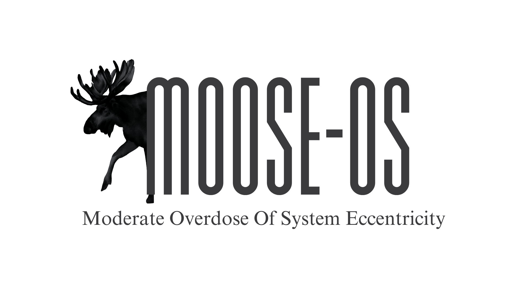

<h1 align="center"></h1>

   


MOOSE is a 80s-style operating system, currently designed to run on virtual machines. \
A detailed list of features can be found in the [README.txt file](./README.txt)

## Getting Started

As of writing, these instructions assume you are running MacOS with Homebrew installed. Feel free to adjust these commands so they can work on your Operating System. We are using Linux binutils, so Linux users can skip some of the prequisites.

### Quick Start

Don't want to read any more? Fair enough. Running this OS is easy. Just install QEMU

```shell
brew install qemu
```

then run

```shell
cd moose-os
make run
```

And enjoy!

### Prerequisites

Please install Homebrew, then install the following dependencies.

First, tap NativeOS' i386 elf toolchain and install it. This is used to link and compile the project.

```shell
brew tap nativeos/i386-elf-toolchain
brew install nativeos/i386-elf-toolchain/i386-elf-binutils
brew install nativeos/i386-elf-toolchain/i386-elf-gcc
```

Next, install QEMU and NASM. QEMU is used to test the operating system in a virtual environment, and NASM is used to compile ASM files.

```shell
brew install qemu nasm
```

Finally, install GRUB. We use GRUB to make the ISO.

```shell
brew install i686-elf-grub
```

### Installing

Since MOOSE has not yet been tested on a real device, here are the steps to install MOOSE on QEMU. Again, these instructions are for MacOS. Please adjust for your Operating System.

First, clone the repository.

```shell
git clone https://github.com/frogtheastronaut/moose-os.git
cd moose-os
```

Then, build the OS. This step is optional as there is most likely a pre-built binary in the bin/ directory. (MooseOS.iso)

```shell
make build-iso
```

Then, to run MooseOS:

```shell
# Run
make run

# Or run fullscreen
make run-fullscreen
```

This will automatically create a 10MB disk image (`bin/moose_disk.img`).

## Built With

- [Make](https://www.gnu.org/software/make/) - Runs Makefiles.
- [Homebrew](https://brew.sh/) - Install Dependencies

## License

This project is licensed under the MIT License - see the [LICENSE.md](LICENSE) file for details
